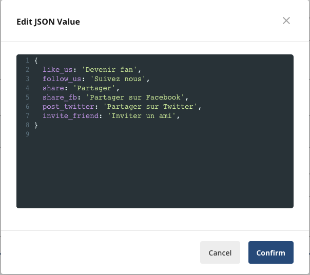

A dynamic config allows you to use configuration parameters to control the behavior of your application in near real-time. 

In the example below, 
the dynamic config called **localization** allows you to retrieve localized strings for users in different countries. 
Users in Spanish speaking countries see Spanish strings, while users in French and Korean speaking countries see French and Korean strings respectively. 

A sample JSON payload for French speakers is also shown below.

The following tutorials show you how to perform common tasks with dynamic configs.

#### Tutorials
- [Create a dynamic config](/dynamic-config/create-new)
- [Create a rule for a dynamic config](/dynamic-config/add-rule)
- [Use a language specific Statsig SDK to implement a dynamic config in your application](/sdks/getting-started)
