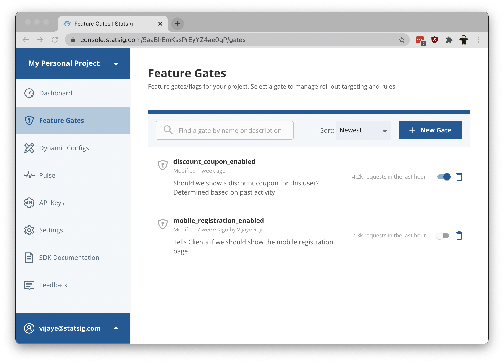

Statsig helps you ship code faster on mobile, web and server side. Iterative
data-driven development is made possible by integrating one of our SDKs.

For single-user, client-side applications, we have:

- [Javascript client SDK](/docs/js-client)
- [Swift client SDK](/docs/swift-client)

For multi-user, server-side applications:

- [Node.js server SDK](/docs/js-server)

We also provide a RESTful API. Our API is a great choice if an SDK isn't
available for your environment yet, as you can use it in any type of
application:

- [RESTful API](/docs/restful-api)

## Account sign up and API key

Regardless of the SDK you pick, you will need to [create a free Statsig
account](https://console.statsig.com/sign_up) or be invited to join an existing
project. This will give you access to the Statsig console, where you can
generate an API key.

The Statsig console currently offers a few different tools - Feature Gates and
Dynamic Configs.

[Feature Gates](https://en.wikipedia.org/wiki/Feature_toggle) (aka Feature
Switches, Feature Toggles, or Feature Flags, etc.) allow you to introduce
conditional branches in code that can be switched on and off for specific set of
users, in realtime.

Dynamic Configs expand on that - while Feature Gates return a boolean
(true/false) value, Dynamic Configs can fetch and return a structured record
that is configurable as JSON in the admin console.

Both **Feature Gates** and **Dynamic Config** allow you to modify the behavior of
production applications for different users without having to push updated code.

To get started, we recommend taking a quick tour around the console, and setting
up a Gate or Dynamic Config to use when you start integrating with an SDK. Our
SDKs function as a bridge to your Statsig console -- once you have integrated an
SDK into your application, you can update Feature Gate conditions or Dynamic
Config values directly in the console, with your application responding
immediately to the new values!

## FAQ

#### I don't see my language listed, can I still use Statsig?

We just released our beta, which includes a few SDKs, as well as an HTTPS API.
If neither of these fit your needs, let us know! Email tore [at] statsig [dot]
com. We're working hard to bring the power of Statsig to your client or server,
and Android/React Native SDKs are next.

#### I want to run an A/B test, can I use Statsig for that?

You can run A/B tests by opening up partial exposures on your Feature Gates and
Mobile Configs. These allow you to test the effect of a new feature. However in
order to run a proper A/B test, you will need to create the right sample size
buckets and those features are coming soon!
