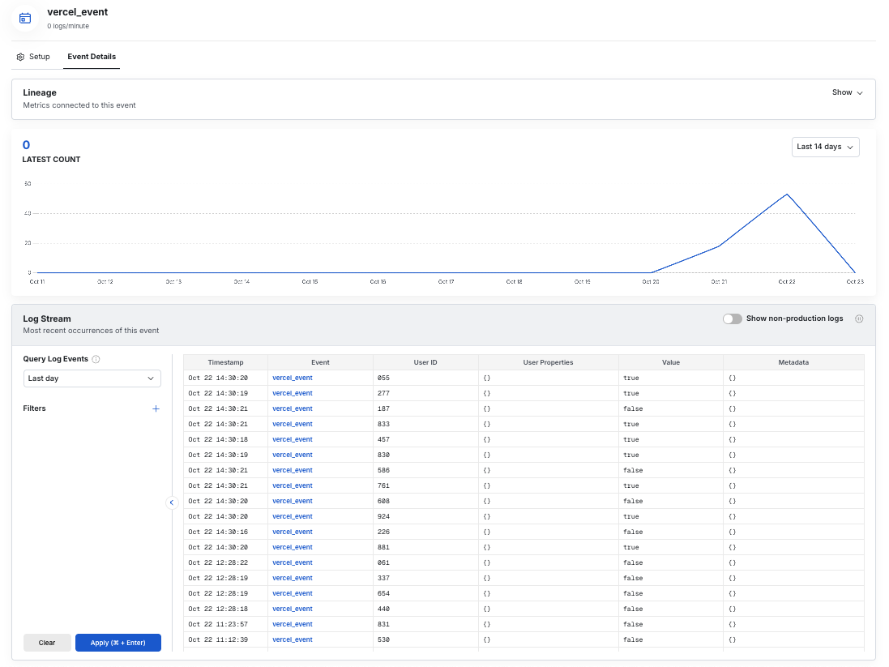

Statsig offers a suite of integration tools that makes usage with Vercel simple:

- Statsig automatically pushes project changes to Vercel's Edge Config, providing low latency SDK startup.
- Statsig offers a Vercel helper that handles client initialization and event flushing, so you can focus on your business logic.

<Steps>
  <Step>
  #### Configure Integration

    1. Head over to the [Vercel Marketplace](https://vercel.com/integrations/statsig) and install the Statsig integration.
    2. You will be prompted to create a new Statsig account or link an existing Statsig account.
        <AccordionGroup>
        <Accordion title = "New Statsig Account">
          - Click **Accept and Create**
          - Enable Edge Config Syncing to have statsig automatically push configs into Vercel's Edge Config
          <Frame>
        
        </Frame>

        Once created, you can select **Open in Statsig** in the top right to set up gates and experiments for your newly created Statsig project.
        <Frame>
        
        </Frame>

        Your Statsig Integration for Vercel is completed!
        </Accordion>

        <Accordion title = "Existing Statsig Account">
          - Select your project and edge config
          - Click **Save**

        Your Statsig Integration is now complete! You can go to the **storage** tab to confirm your Statsig config specs have propagated to your Edge Config.

        </Accordion>
        </AccordionGroup>
  </Step>

  <Step>
  #### Install the Statsig SDK
    ```bash
    npm install @statsig/vercel-edge
    ```
  </Step>

  <Step>
  #### import the Vercel helper
  ```bash
  import {handleWithStatsig} from '@statsig/vercel-edge
  ```
  </Step>
  <Step>
  #### Use the SDK
  ```Javascript
  export default handleWithStatsig(handler, params)
  ```
  The helper method takes two arguments:
  - `handler` This is your Vercel function code
  - `params` 
      | Parameter | Optional | Type | Description |
    |-----------|----------|------|-------------|
    | `configKey` | No | `string` | The Key associated with your Statsig specs in your Edge Config |
    | `envStatsigKey` | No | `string` | Your Statsig Client API Key |
    | `statsigOptions` | Yes | `StatsigOptions` | See StatsigOptions [here](/client/javascript-sdk#statsig-options) |

  For best practice:
  - Store `configKey` and `envStatsigKey` as environment variables in your Vercel project settings

  </Step>
</Steps>

### Example Usage

```javascript api/index.js
import { handleWithStatsig } from "@statsig/vercel-edge";

export const config = {runtime: 'edge'};

async function myHandler(request, client){
    const user = { userID: Math.random().toString().substring(2, 5) }; //Generates a random user id
    const passed = client.checkGate('test_vercel_edgeconfig', user);
    client.logEvent('vercel_wrapper', user, passed.toString());
    return new Response(
      JSON.stringify({ passed, user })
    );

export default handleWithStatsig(myHandler,{
    configKey : process.env.EDGE_CONFIG_KEY,
    statsigSdkKey: process.env.STATSIG_KEY
})
```
<Accordion title="How it Works">
The `handler` parameter is **your Vercel function code** .This is the same code you would normally export directly in your API route (for example, `myHandler` in the snippet above).  
Instead of exporting it, you pass it into `handleWithStatsig`, which takes care of the Statsig setup and cleanup for you.  

**Here’s what happens behind the scenes:**
1. The Statsig SDK initializes a client using the config specs stored in your Edge Config.  
2. Your function code (the handler) runs as usual.  
3. Any events you log are automatically flushed back to Statsig when execution finishes.  

**Your Vercel function behaves exactly the same, but you no longer need to manually handle Statsig initialization or event flushing.**
</Accordion>

**That's it!** The helper automatically:

- Initializes the Statsig Client with config specs from your Edge Config
- Executes your Vercel function code (Your business logic + Statsig usage)
- Flushes all events after your handler completes execution
- Cleans up resources

## Advanced Implementation

<Accordion title="Advanced/manual usage">
**Use the advanced/manual setup if:**

- You need fine-grained control over initialization timing
- You need fine-grained control over event flushing timing
- You need to customize error handling behavior 

### Prerequisites
- Completed the [Statsig Vercel integration setup](#configure-integration)


<Steps>
  <Step title="Install the Statsig SDK">
  ```bash
  npm install @statsig/vercel-edge
  ```
  </Step>

  <Step title="Import the Statsig SDK">
  ```bash
  import {StatsigVercelClient} from '@statsig/vercel-edge'
  ```
  </Step>

  <Step title="Creating a StatsigVercelClient instance">
  ```javascript
  const client = new StatsigVercelClient(process.env.STATSIG_KEY)
  ```
  The client instantiation takes two arguments:
  - `sdkKey : string`  This is your Statsig client API key. It is available from the [Project Settings](https://console.statsig.com/api_keys) page in the Statsig Console.  This is used to authenticate your requests.
  - `options : StatsigOptions` See here, for more [options](/client/javascript-sdk#statsig-options).

  For best practice:
  - Store `sdkKey` as an environment variable in your Vercel project settings
  </Step>

  <Step title = "Client Initialization">
    The following line initializes the client by loading feature gate and experiment configurations directly from your Vercel Edge Config.
  
    ```javascript
    const init = await client.initializeFromEdgeConfig(<YOUR_EDGE_CONFIG_KEY>);
    ```
    The client initialization takes one argument:

    - `ConfigKey : string` The Key associated with your Statsig specs in your Edge Config
  </Step>

  <Step title = "Checking a Gate">
    ```javascript
    const GateResult = client.checkGate('pass_gate', user);
    ```
    This is a gate check in code.

    The `checkGate` method takes two arguments:
    - `name : string` The name of the Statsig gate that you are checking. 
    - `user : StatsigUser` The Statsig user object for whom the gate is being checked. For more information on the user object, see [here](/sdks/user#introduction-to-the-statsiguser-object).

    Refer to the [Javascript on device evaluation sdk documentation](/client/jsOnDeviceEvaluationSDK) for how to check other entities like experiments and dynamic configs.

  </Step>

  <Step>
    ```javascript
    client.logEvent('gate_check', { userID: randomUserId });
    ```
    This is an event log in code. 

    The `logEvent` method takes two parameters:
    - `eventOrName : string | StatsigEvent` This is the name and details of the event you are logging.
    - `user : StatsigUser` The Statsig user object for whom the event is being logged.

    For more information on event logging, see [here](https://docs.statsig.com/client/jsOnDeviceEvaluationSDK#logging-an-event).
  </Step>

  <Step>
  ```javascript
  waitUntil(statsig.flush());
  ```
  This flushes all events from the SDK to Statsig.  **Without this, you will not be able to get diagnostic information in the Statsig Console, nor any event data you logged**.

  </Step>


</Steps>

### Putting it all together

```javascript api/index.js
import { StatsigVercelClient } from '@statsig/vercel-edge';
import { waitUntil } from '@vercel/functions';

export const config = {
  runtime: 'edge', 
};

export default async function handler(request) {
    const client = new StatsigVercelClient(process.env.STATSIG_KEY);
    
    let init = await client.initializeFromEdgeConfig(process.env.EDGE_CONFIG_KEY);
    
    const user = { userID: Math.random().toString().substring(2, 5) };
    const passed = client.checkGate('pass_gate', user);
    
    client.logEvent('vercel_event', user, passed.toString());
    
    waitUntil(client.flush())

    return new Response(
      JSON.stringify({ passed, user }),
    );
}
```
## Other Considerations

### Polling for updates v5.13.0+

The SDK cannot poll for updates across requests since Vercel Edge Functions do not allow for timers outside of the request handler.
To optimize for edge use cases, we do not provide an api to recognize updates to your config specs. However, when a change is made to your project definition on the Statsig console, the changes will be propagated to your Edge Config and will be reflected the next time you initialize the Statsig client.


### Flushing events v4.16.0+

The SDK enqueues logged events and flushes them in batches. In order to ensure events are properly flushed, we recommend calling flush using `waitUntil()` from `@vercel/functions`. This will keep the request handler alive until events are flushed without blocking the response.

```
waitUntil(client.flush());
```

### Size Limits

Vercel Edge Config has maximum size limits that may prevent Statsig from pushing configs into your Edge Config. See [here](https://vercel.com/docs/concepts/edge-network/edge-config/edge-config-limits) for the latest Vercel Edge Config limits.

### Unsupported Features

Statsig ID Lists are not currently synced into Vercel Edge Config. If you rely on large (>1000) ID lists, you will not be able to check them in your Vercel edge functions. This is why we set `initStrategyForIDLists: 'none'` in the SDK initialization.

</Accordion>

If you want to check on the evaluations you are getting, you can go to the gate you created for this example and look at the evaluations in the Diagnostics tab.
<Frame>
  
</Frame>

If you want to check the events you logged, in the **Statsig Console**, go to **Data** -> **Events**
<Frame>
  
</Frame>

And there you have it - a working Vercel Edge Config integration for Statsig.

## Using Flags SDK in NextJS

If you're using NextJS in your Vercel project, you can use Statsig through Flags SDK and take advantage of built in precompute patterns for improved performance. See the [Statsig Adapter for Flags SDK docs](https://flags-sdk.dev/docs/api-reference/adapters/statsig) for steps on how to get started.
Note that the marketplace app sets all required environment variables for the Flags SDK by default for a quick setup process.

## Sending logs to Statsig

You can connect your Vercel logs to Statsig with a Log Drain to start exploring them in Logs Explorer.

1.  From the [Vercel dashboard](https://vercel.com/), go to **Settings -> Drains** and click **Add Drain -> Integration**.
2.  Select **Statsig**, follow the configuration steps provided, and choose a project to connect with the service.
3.  Navigate to [Statsig's Logs Explorer](https://console.statsig.com/logs) to see your logs flow through.
